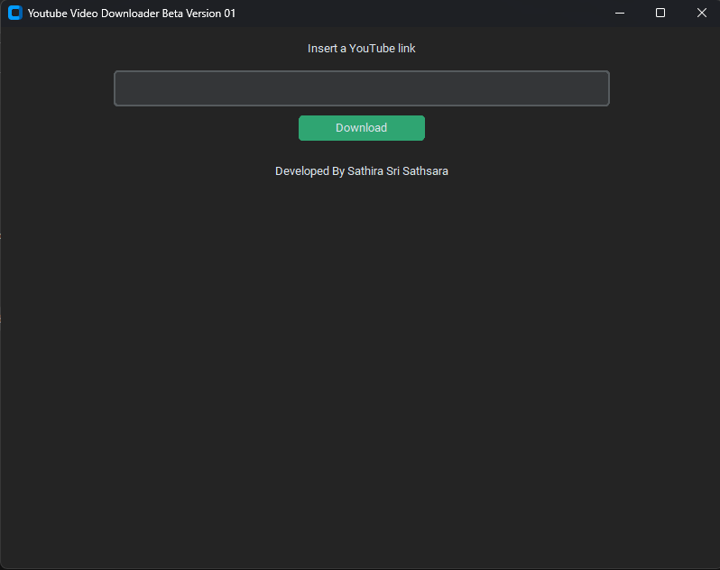

# YouTube Video Downloader

This project is a YouTube video downloader built in Python and bat script, utilizing the `yt-dlp` library and `ffmpeg`. It provides a convenient way to download YouTube videos and save them locally.

## Features

- Download YouTube videos in various formats and qualities
- Supports downloading entire playlists or individual videos
- Automatically extracts video metadata, including title, duration, and thumbnail
- Convert videos to different formats using `ffmpeg`

## Windows Application
If you prefer using a Windows application instead of running the Python script, you can download the executable file from the <a href="https://github.com/SathiraSriSathsara/yt-downloader/releases/download/beta-v01/yt-downloader-beta_v01.zip">latest release.</a>

1. Download the ZIP file from the above link.

2. Extract the contents to a directory on your computer.

3. Double-click on the `yt-downloader-beta-v01.exe` file to launch the application.

## Screenshots 

## Contributing

Contributions to this project are welcome. If you encounter any issues or have suggestions for improvements, please open an issue on the GitHub repository.

## License

This project is licensed under the MIT License.

## Disclaimer

Please be aware that downloading videos from YouTube may violate the platform's terms of service or copyright laws in your country. Use this tool responsibly and respect the rights of content creators.

